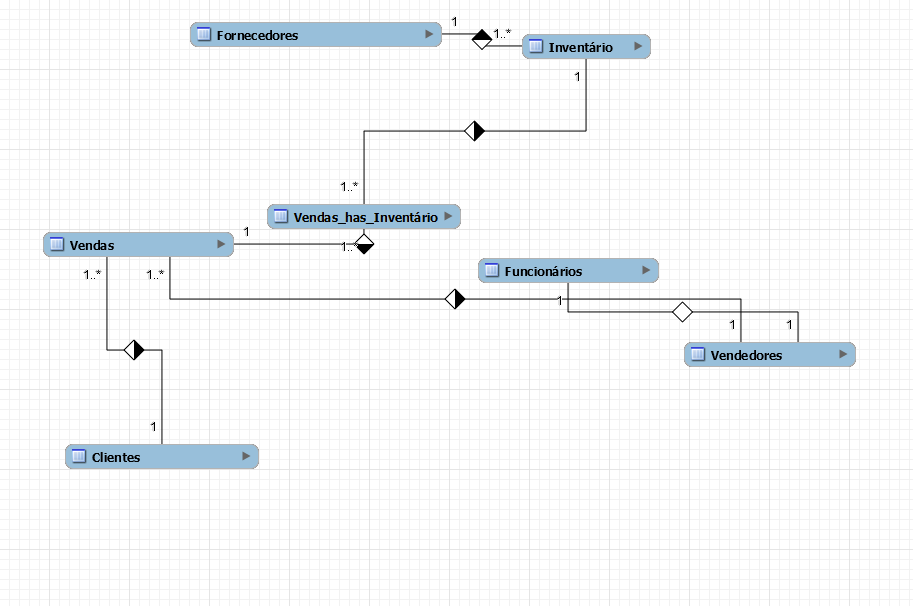
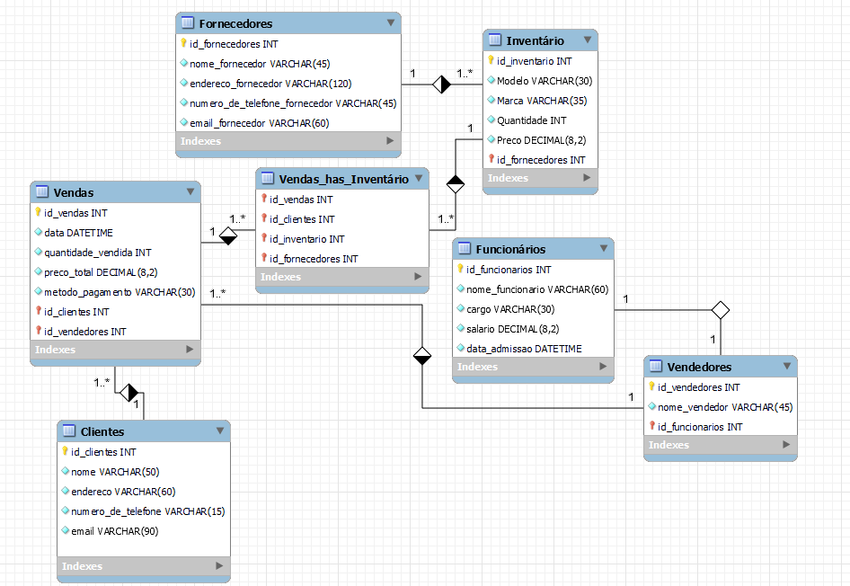

# Estudo de caso
## O caso da Empresa BikeShop

Visão Geral:

A BikeShop é uma empresa especializada na venda de bicicletas e acessórios relacionados. 
Localizada em uma área urbana movimentada de Uberlândia, Minas Gerais, a empresa tem 
como objetivo oferecer uma variedade de bicicletas de alta qualidade para ciclistas de todos os 
níveis, desde iniciantes até ciclistas experientes e entusiastas.

Desafio:

A BikeShop está crescendo rapidamente e enfrenta desafios no gerenciamento eficiente de seu 
inventário, clientes e vendas. Atualmente, eles estão registrando essas informações 
manualmente ou usando planilhas eletrônicas, o que se tornou ineficiente e propenso a erros. 
Eles reconhecem a necessidade de um sistema de banco de dados centralizado que possa 
armazenar e gerenciar essas informações de forma mais eficaz.

Objetivos do Sistema de Banco de Dados:

Gerenciar o inventário de bicicletas e acessórios, incluindo detalhes como modelo, marca, 
quantidade em estoque, preço de venda e fornecedor.
Manter um registro centralizado de clientes, incluindo informações como nome, endereço, 
número de telefone, endereço de e-mail e histórico de compras.
Registrar e acompanhar as vendas de bicicletas e acessórios, incluindo detalhes como data da 
venda, produtos vendidos, preço de venda, método de pagamento e vendedor responsável.

### Com base no estudo de caso acima, foi construido um mmodeleo conceitual para desenvolvimento de um banco de dados que atenda a Empresa BikeShop

### Modelo Conceitual



### Modelo Logico



### Codigo SQL para modelo fisico do banco de dados 

```sql


-- MySQL Workbench Forward Engineering

SET @OLD_UNIQUE_CHECKS=@@UNIQUE_CHECKS, UNIQUE_CHECKS=0;
SET @OLD_FOREIGN_KEY_CHECKS=@@FOREIGN_KEY_CHECKS, FOREIGN_KEY_CHECKS=0;
SET @OLD_SQL_MODE=@@SQL_MODE, SQL_MODE='ONLY_FULL_GROUP_BY,STRICT_TRANS_TABLES,NO_ZERO_IN_DATE,NO_ZERO_DATE,ERROR_FOR_DIVISION_BY_ZERO,NO_ENGINE_SUBSTITUTION';

-- -----------------------------------------------------
-- Schema mydb
-- -----------------------------------------------------

-- -----------------------------------------------------
-- Schema mydb
-- -----------------------------------------------------
CREATE SCHEMA IF NOT EXISTS `mydb` DEFAULT CHARACTER SET utf8 ;
USE `mydb` ;

-- -----------------------------------------------------
-- Table `mydb`.`Fornecedores`
-- -----------------------------------------------------
CREATE TABLE IF NOT EXISTS `mydb`.`Fornecedores` (
  `id_fornecedores` INT NULL AUTO_INCREMENT,
  `nome_fornecedor` VARCHAR(45) NOT NULL,
  `endereco_fornecedor` VARCHAR(120) NOT NULL,
  `numero_de_telefone_fornecedor` VARCHAR(45) NOT NULL,
  `email_fornecedor` VARCHAR(60) NOT NULL,
  PRIMARY KEY (`id_fornecedores`),
  UNIQUE INDEX `nome_fornecedor_UNIQUE` (`nome_fornecedor` ASC) VISIBLE,
  UNIQUE INDEX `endereco_fornecedor_UNIQUE` (`endereco_fornecedor` ASC) VISIBLE,
  UNIQUE INDEX `numero_de_telefone_fornecedor_UNIQUE` (`numero_de_telefone_fornecedor` ASC) VISIBLE,
  UNIQUE INDEX `email_fornecedor_UNIQUE` (`email_fornecedor` ASC) VISIBLE)
ENGINE = InnoDB;


-- -----------------------------------------------------
-- Table `mydb`.`Inventário`
-- -----------------------------------------------------
CREATE TABLE IF NOT EXISTS `mydb`.`Inventário` (
  `id_inventario` INT NULL AUTO_INCREMENT,
  `Modelo` VARCHAR(30) NOT NULL,
  `Marca` VARCHAR(35) NOT NULL,
  `Quantidade` INT NOT NULL,
  `Preco` DECIMAL(8,2) NOT NULL,
  `id_fornecedores` INT NOT NULL,
  PRIMARY KEY (`id_inventario`, `id_fornecedores`),
  INDEX `fk_Inventário_Fornecedores_idx` (`id_fornecedores` ASC) VISIBLE,
  CONSTRAINT `fk_Inventário_Fornecedores`
    FOREIGN KEY (`id_fornecedores`)
    REFERENCES `mydb`.`Fornecedores` (`id_fornecedores`)
    ON DELETE NO ACTION
    ON UPDATE NO ACTION)
ENGINE = InnoDB;


-- -----------------------------------------------------
-- Table `mydb`.`Clientes`
-- -----------------------------------------------------
CREATE TABLE IF NOT EXISTS `mydb`.`Clientes` (
  `id_clientes` INT NULL AUTO_INCREMENT,
  `nome` VARCHAR(50) NOT NULL,
  `endereco` VARCHAR(60) NOT NULL,
  `numero_de_telefone` VARCHAR(15) NOT NULL,
  `email` VARCHAR(90) NOT NULL,
  PRIMARY KEY (`id_clientes`),
  UNIQUE INDEX `email_UNIQUE` (`email` ASC) VISIBLE)
ENGINE = InnoDB;


-- -----------------------------------------------------
-- Table `mydb`.`Funcionários`
-- -----------------------------------------------------
CREATE TABLE IF NOT EXISTS `mydb`.`Funcionários` (
  `id_funcionarios` INT NOT NULL AUTO_INCREMENT,
  `nome_funcionario` VARCHAR(60) NOT NULL,
  `cargo` VARCHAR(30) NOT NULL,
  `salario` DECIMAL(8,2) NOT NULL,
  `data_admissao` DATETIME NOT NULL,
  PRIMARY KEY (`id_funcionarios`))
ENGINE = InnoDB;


-- -----------------------------------------------------
-- Table `mydb`.`Vendedores`
-- -----------------------------------------------------
CREATE TABLE IF NOT EXISTS `mydb`.`Vendedores` (
  `id_vendedores` INT NOT NULL AUTO_INCREMENT,
  `nome_vendedor` VARCHAR(45) NOT NULL,
  `id_funcionarios` INT NOT NULL,
  PRIMARY KEY (`id_vendedores`, `id_funcionarios`),
  INDEX `fk_Vendedores_Funcionários1_idx` (`id_funcionarios` ASC) VISIBLE,
  CONSTRAINT `fk_Vendedores_Funcionários1`
    FOREIGN KEY (`id_funcionarios`)
    REFERENCES `mydb`.`Funcionários` (`id_funcionarios`)
    ON DELETE NO ACTION
    ON UPDATE NO ACTION)
ENGINE = InnoDB;


-- -----------------------------------------------------
-- Table `mydb`.`Vendas`
-- -----------------------------------------------------
CREATE TABLE IF NOT EXISTS `mydb`.`Vendas` (
  `id_vendas` INT NULL AUTO_INCREMENT,
  `data` DATETIME NOT NULL,
  `quantidade_vendida` INT NOT NULL,
  `preco_total` DECIMAL(8,2) NOT NULL,
  `metodo_pagamento` VARCHAR(30) NOT NULL,
  `id_clientes` INT NOT NULL,
  `id_vendedores` INT NOT NULL,
  PRIMARY KEY (`id_vendas`, `id_clientes`, `id_vendedores`),
  INDEX `fk_Vendas_Clientes1_idx` (`id_clientes` ASC) VISIBLE,
  INDEX `fk_Vendas_Vendedores1_idx` (`id_vendedores` ASC) VISIBLE,
  CONSTRAINT `fk_Vendas_Clientes1`
    FOREIGN KEY (`id_clientes`)
    REFERENCES `mydb`.`Clientes` (`id_clientes`)
    ON DELETE NO ACTION
    ON UPDATE NO ACTION,
  CONSTRAINT `fk_Vendas_Vendedores1`
    FOREIGN KEY (`id_vendedores`)
    REFERENCES `mydb`.`Vendedores` (`id_vendedores`)
    ON DELETE NO ACTION
    ON UPDATE NO ACTION)
ENGINE = InnoDB;


-- -----------------------------------------------------
-- Table `mydb`.`Vendas_has_Inventário`
-- -----------------------------------------------------
CREATE TABLE IF NOT EXISTS `mydb`.`Vendas_has_Inventário` (
  `id_vendas` INT NOT NULL,
  `id_clientes` INT NOT NULL,
  `id_inventario` INT NOT NULL,
  `id_fornecedores` INT NOT NULL,
  PRIMARY KEY (`id_vendas`, `id_clientes`, `id_inventario`, `id_fornecedores`),
  INDEX `fk_Vendas_has_Inventário_Inventário1_idx` (`id_inventario` ASC, `id_fornecedores` ASC) VISIBLE,
  INDEX `fk_Vendas_has_Inventário_Vendas1_idx` (`id_vendas` ASC, `id_clientes` ASC) VISIBLE,
  CONSTRAINT `fk_Vendas_has_Inventário_Vendas1`
    FOREIGN KEY (`id_vendas` , `id_clientes`)
    REFERENCES `mydb`.`Vendas` (`id_vendas` , `id_clientes`)
    ON DELETE NO ACTION
    ON UPDATE NO ACTION,
  CONSTRAINT `fk_Vendas_has_Inventário_Inventário1`
    FOREIGN KEY (`id_inventario` , `id_fornecedores`)
    REFERENCES `mydb`.`Inventário` (`id_inventario` , `id_fornecedores`)
    ON DELETE NO ACTION
    ON UPDATE NO ACTION)
ENGINE = InnoDB;


SET SQL_MODE=@OLD_SQL_MODE;
SET FOREIGN_KEY_CHECKS=@OLD_FOREIGN_KEY_CHECKS;
SET UNIQUE_CHECKS=@OLD_UNIQUE_CHECKS;

```